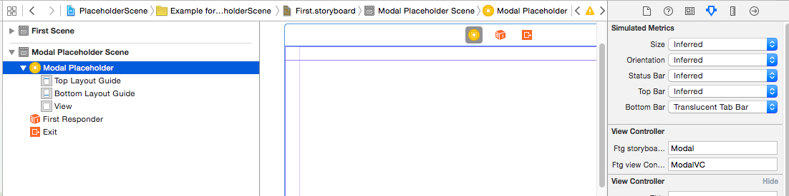
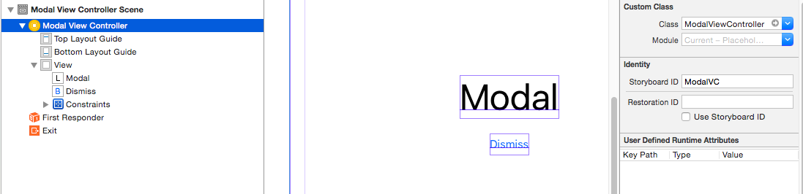

# PlaceholderScene
Mimicking storyboard reference through placeholder view controllers

[](https://travis-ci.org/Khoa Pham/PlaceholderScene)
[](http://cocoapods.org/pods/PlaceholderScene)
[](http://cocoapods.org/pods/PlaceholderScene)
[](http://cocoapods.org/pods/PlaceholderScene)

## Usage

To run the example project, clone the repo, and run `pod install` from the Example directory first.

### Features
- Resolve placeholder view controllers
- Resolve child view controllers for `UITabBarController` and `UINavigationController`

### Storyboard setup
In one Storyboard, configure the placeholder view controller


And in the destination Storyboard, configure the Storyboard ID for the real view controller


## Installation

PlaceholderScene is available through [CocoaPods](http://cocoapods.org). To install
it, simply add the following line to your Podfile:

```ruby
pod "PlaceholderScene"
```

## Author

Khoa Pham, onmyway133@gmail.com

## License

PlaceholderScene is available under the MIT license. See the LICENSE file for more info.
